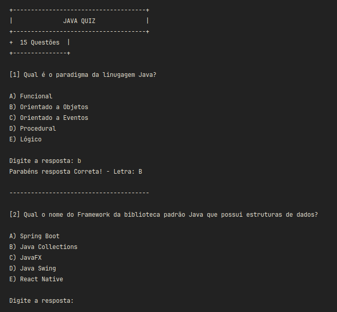

# Projeto QUIZ - Algoritmos e Linguagem de Programação II

## 📚 Sobre o Projeto

Este projeto tem como objetivo aplicar os conceitos estudados na disciplina **Algoritmos e Linguagem de Programação II** utilizando a linguagem de programação **Java**.

Os alunos do **2º período** dos cursos de **Engenharia de Software** e **Segurança da Informação** irão desenvolver um sistema de **Quiz (Perguntas e Respostas)** que será executado via **console/terminal**.

---

## 🎯 Objetivo

Criar um sistema simples de perguntas e respostas que:
- Instancie uma lista de **15 questões** (objetos da classe `Questao`);
- Apresente cada questão ao usuário, permitindo a escolha de uma alternativa;
- No final, exiba:
    - A **quantidade de acertos** do usuário;
    - A **porcentagem de acertos** com base no total de questões.

---

## 🧱 Estrutura Básica

- Linguagem: `Java`
- Ambiente: `Console (Terminal)`
- Arquivos principais:
    - `Questao.java`: classe fornecida com os atributos da questão (enunciado, alternativas e resposta correta).
    - `Main.java`: responsável pela execução do programa e interação com o usuário.

---

## ✅ Requisitos

- Utilizar estrutura de repetição e condicionais (`for`, `if`, `switch`, etc.).
- Utilizar arrays ou listas para armazenar as questões.
- Calcular e exibir corretamente o total de acertos e a porcentagem.
- Utilizar boas práticas de codificação: indentação, nomes claros e comentários.

---

## 🧪 Exemplo de Execução

## 🧱 UML - Diagrama de Classes

